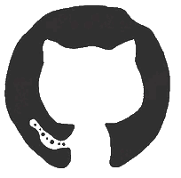

# StockOverflow

A real-time stock market dashboard with comprehensive market data visualization and analysis tools.

##  
<br/>

##  Features

- Real-time market data visualization for Nifty and Sensex indices
- Interactive candlestick charts with technical indicators
- Market movers tracking (top gainers and losers)
- Real-time market ticker strip
- Responsive and modern UI design

<br/>

##  Tech Stack

- React.js
- ApexCharts.js for data visualization
- APIs such as AlphaVantage and Yahoo Finance
- Hardhat & Solidity for blockchain
- HTML 
- CSS for styling

<br/>

##  Frontened


 

### Homepage


 

### Markets


 

### News 

 

### BlockChain


 

### Portfolio


##  How to Run

```
npm install
npm start
```

<br/>
Start the blockchain server from the child repository

##  Child Repositry: https://github.com/Unknnownnn/StockOverflow-Blk

## License

[MIT](https://choosealicense.com/licenses/mit/)
